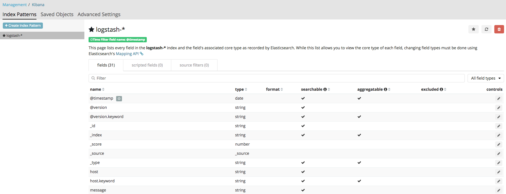
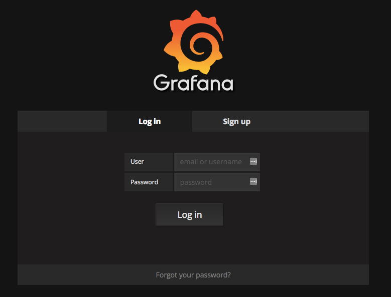
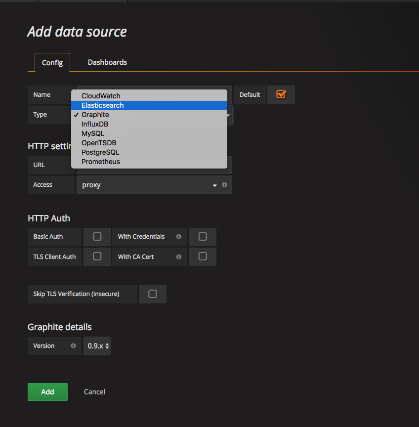
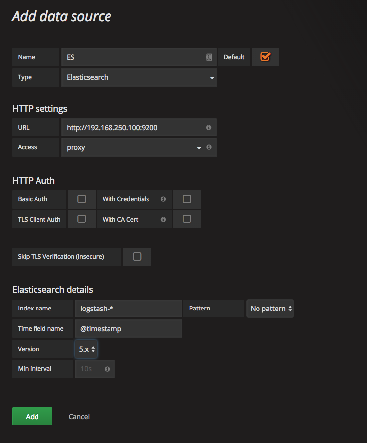
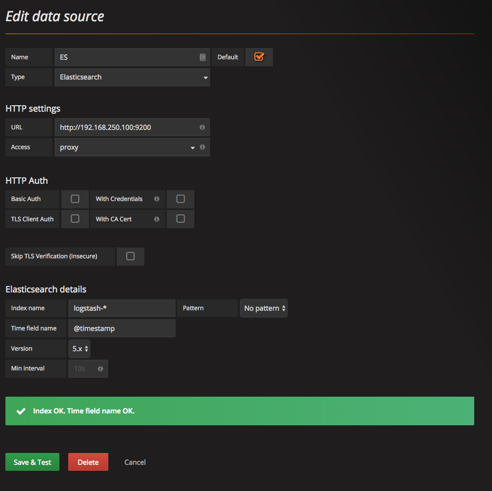

## Purpose

Spin up a usable ELK Stack deployment within Vagrant for learning and POC's.

## Requirements

### Software

-   [Ansible](https://www.ansible.com)
-   [Vagrant](https://www.vagrantup.com)
-   [Virtualbox](https://www.virtualbox.org)

## Quick How-To

### Spinning Up

```bash
git clone https://github.com/mrlesmithjr/vagrant-ansible-elkstack.git
cd vagrant-ansible-elkstack
vagrant up
```

### Kibana

Once everything has been spun up you can connect to the [Kibana WebUI](http://192.168.250.100:5601)
and setup the index pattern as seen in the screenshot below:


After clicking `Create` you will now see:



And you are now ready to begin exploring some events, so click `Discover`


And now you should see some events:


### Grafana

Grafana is also part of the stack for additional visualization.

You can connect to the [Grafana WebUI](http://192.168.250.100:3000). And you will
be presented with the following login screen:



Login using `admin:admin` which is the default login account. Once logged in for
the first time you should be presented with the following screen to `Add data source`:


Click `Add data source` and select `Elasticsearch` from the dropdown:



Now fill out the details as in the example below:



Once all of the details have been filled out as above click `Add`:



### Tearing Down

When you are done tear it all down easily...

```bash
./scripts/cleanup.sh
```

## Environment

> NOTE: The default deployment here is based on `Ubuntu 16.04`.

Adjusting VMs to spin up are defined in [nodes.yml](nodes.yml). You may also
want to checkout [customizing-environment](https://github.com/mrlesmithjr/vagrant-box-templates#customizing-environment).

### Example Ansible inventory which is generated when [Spinning Up](#spinning-up)

```bash
# Generated by Vagrant

broker-01 ansible_host=127.0.0.1 ansible_port=2201 ansible_user='vagrant' ansible_ssh_private_key_file='/Users/larry/Git_Projects/Personal/GitHub/mrlesmithjr/vagrant-ansible-elkstack/.vagrant/machines/broker-01/virtualbox/private_key'
broker-02 ansible_host=127.0.0.1 ansible_port=2202 ansible_user='vagrant' ansible_ssh_private_key_file='/Users/larry/Git_Projects/Personal/GitHub/mrlesmithjr/vagrant-ansible-elkstack/.vagrant/machines/broker-02/virtualbox/private_key'
broker-03 ansible_host=127.0.0.1 ansible_port=2203 ansible_user='vagrant' ansible_ssh_private_key_file='/Users/larry/Git_Projects/Personal/GitHub/mrlesmithjr/vagrant-ansible-elkstack/.vagrant/machines/broker-03/virtualbox/private_key'
dashboard-01 ansible_host=127.0.0.1 ansible_port=2209 ansible_user='vagrant' ansible_ssh_private_key_file='/Users/larry/Git_Projects/Personal/GitHub/mrlesmithjr/vagrant-ansible-elkstack/.vagrant/machines/dashboard-01/virtualbox/private_key'
es-01 ansible_host=127.0.0.1 ansible_port=2206 ansible_user='vagrant' ansible_ssh_private_key_file='/Users/larry/Git_Projects/Personal/GitHub/mrlesmithjr/vagrant-ansible-elkstack/.vagrant/machines/es-01/virtualbox/private_key'
es-02 ansible_host=127.0.0.1 ansible_port=2207 ansible_user='vagrant' ansible_ssh_private_key_file='/Users/larry/Git_Projects/Personal/GitHub/mrlesmithjr/vagrant-ansible-elkstack/.vagrant/machines/es-02/virtualbox/private_key'
es-03 ansible_host=127.0.0.1 ansible_port=2208 ansible_user='vagrant' ansible_ssh_private_key_file='/Users/larry/Git_Projects/Personal/GitHub/mrlesmithjr/vagrant-ansible-elkstack/.vagrant/machines/es-03/virtualbox/private_key'
lb-01 ansible_host=127.0.0.1 ansible_port=2222 ansible_user='vagrant' ansible_ssh_private_key_file='/Users/larry/Git_Projects/Personal/GitHub/mrlesmithjr/vagrant-ansible-elkstack/.vagrant/machines/lb-01/virtualbox/private_key'
lb-02 ansible_host=127.0.0.1 ansible_port=2200 ansible_user='vagrant' ansible_ssh_private_key_file='/Users/larry/Git_Projects/Personal/GitHub/mrlesmithjr/vagrant-ansible-elkstack/.vagrant/machines/lb-02/virtualbox/private_key'
pre-processor-01 ansible_host=127.0.0.1 ansible_port=2204 ansible_user='vagrant' ansible_ssh_private_key_file='/Users/larry/Git_Projects/Personal/GitHub/mrlesmithjr/vagrant-ansible-elkstack/.vagrant/machines/pre-processor-01/virtualbox/private_key'
processor-01 ansible_host=127.0.0.1 ansible_port=2205 ansible_user='vagrant' ansible_ssh_private_key_file='/Users/larry/Git_Projects/Personal/GitHub/mrlesmithjr/vagrant-ansible-elkstack/.vagrant/machines/processor-01/virtualbox/private_key'

[elkstack]
lb-01
lb-02
broker-01
broker-02
broker-03
pre-processor-01
processor-01
es-01
es-02
es-03
dashboard-01

[loadbalancers]
lb-01
lb-02

[brokers]
broker-01
broker-02
broker-03

[pre_processors]
pre-processor-01

[processors]
processor-01

[elasticsearch]
es-01
es-02
es-03

[dashboard]
dashboard-01
```

## Testing

For some testing to ensure that you can get a good sample of different log types
you can spin up the included Docker Wordpress stack. The logging driver within
the `docker-compose.yml` has been defined as below:

```yaml
logging:
  driver: syslog
  options:
    syslog-address: "tcp://192.168.250.100"
```

To spin the stack up you need to ensure that you have Docker installed and functional
on your workstation. So to spin it up just do the following:

```bash
cd tests/docker-ansible-wordpress
docker-compose up
```

And you should see the following:

```bash
db_1         | WARNING: no logs are available with the 'syslog' log driver
wordpress_1  | WARNING: no logs are available with the 'syslog' log driver
```

Now head over to your [Kibana WebUI](http://192.168.250.100:5601) and you should
see events such as below:


